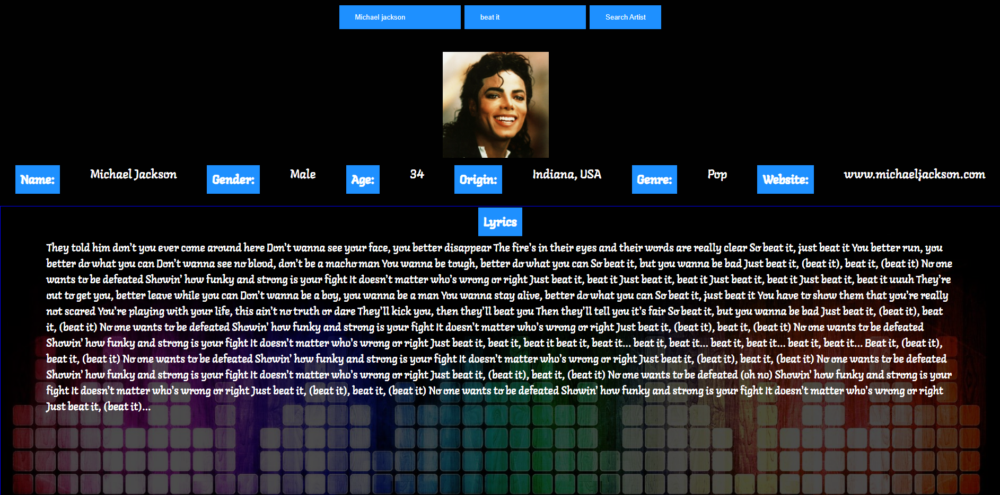

# Artist_Lyrics_Website

 ## Timeframe
 
| Task | Priority | Estimated Time | Time Invested | Actual Time |
| --- | :---: |  :---: | :---: | :---: |
| Setting up site framework | H | 1 hrs| 1.5 hrs | 1.5 hrs |
| Getting API to log and render | H |  1.25 hrs| 3 hrs | 3 hrs | Spotify API didn't work
| Creating game logic | H | 2 hrs| 3 hrs |  3 hrs  |
| Getting search bars functioning | M | 1 hrs|  2 hrs | 2 hrs |
| Styling| M | 2 hrs|   4 hrs|  4 hrs |
| Responsive Styling | L | 2 hrs| 2 hrs |  2 hrs  |
| Total | X | 9.25 hrs | 15.5 hrs  |  15.5 hrs|

## Project Schedule 

|  Day | Deliverable | Status
|---|---| ---|
|Dec 17| Project Pitch / Wireframes | Complete
|Dec 18| JavaScript/API | Complete
|Dec 19 - 20 | JavaScript/API/CSS | Complete
|Dec 22| CSS  | Complete
|Dec 22| finalizing | Complete
|Dec 23| Presentations |

## Technologies Used 
* JavaScript
* HTML5
* CSS3

## User Stories 
* As a user, I want to see information about the artist I searched
* As a user. I want to see the lyrics to the song I searched
* As a user, I want the information displayed to be organized and easy to read
* As a user, I would like to search more than one artist
* As a user, I would like to see an image of the artist

## Wireframes 
Format: 

## Descriptions of any Unsolved problems or major hurdles you had to overcome

## Screenshot of Website 

## Link
https://mohsin231.github.io/Artist_Lyrics_Lookup/

