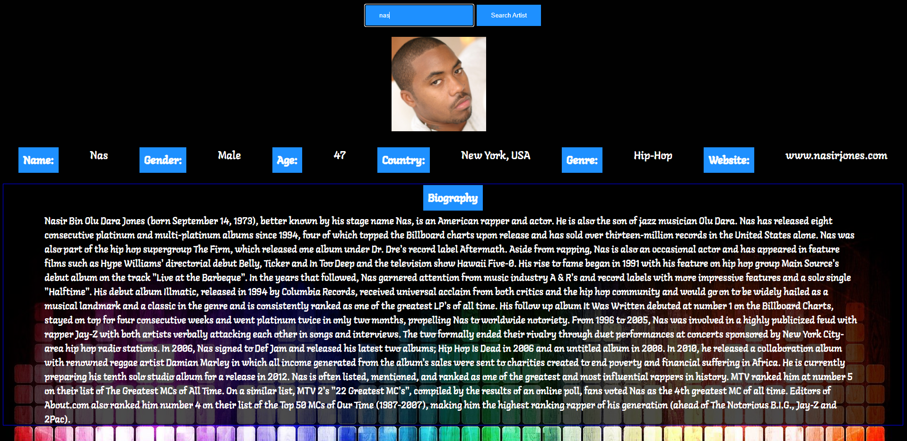

# Artist_Lookup_API

 An embedded screenshot of the app
 Technologies used: JavaScript, HTML5, CSS3
 Installation instructions
 Your User stories – who are your users, what do they want and why?
 Wireframes – sketches of major views / interfaces in your application
 
 Descriptions of any Unsolved problems or major hurdles you had to overcome
 
| Task | Priority | Estimated Time | Time Invested | Actual Time |
| --- | :---: |  :---: | :---: | :---: |
| Setting up site framework | H | 1 hrs| 1.5 hrs | 1.5 hrs |
| Getting API to log and render | H |  1.25 hrs| 3 hrs | 3 hrs | Spotify API didn't work
| Creating game logic | H | 2 hrs| 2 hrs |  2 hrs  |
| Getting search bars functioning | M | 1 hrs|  2 hrs | 2 hrs |
| Styling| M | 2 hrs|   2.5 hrs|  2.5 hrs |
| Responsive Styling | L | 2 hrs| 2 hrs |  2 hrs  |
| Total | X | 9.25 hrs | 13 hrs  |  13 hrs|

Link: https://mohsin231.github.io/Artist_Lookup_API/

